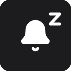

# Shortcuts for Windows

A StreamDock plugin that puts Windows shortcuts on your deck. The first action is a **Do Not Disturb toggle for Windows 11**: press the key to turn Do Not Disturb on or off, and the key always shows the real Windows state.

<p>
  
  &nbsp;
  
</p>

## Features

- One-press toggle for Windows 11 Do Not Disturb.
- Always in sync: change Do Not Disturb from the Notification Center or the Settings app and the key follows within about 2 seconds.
- Several keys, pages or devices with the action update together.
- Shows an alert on the key if Windows rejects the change.
- No administrator rights, no network access, no data collection.

## Compatibility

| | Status |
| --- | --- |
| Windows 11 | Supported (tested on 25H2, build 26200) |
| Fifine AmpliGame with Fifine Control Deck 3.10 | Tested on the AmpliGame D6 |
| Other StreamDock-based apps (Node.js 20 runtime) | Expected to work |
| Elgato Stream Deck 7.1+ | Supported, published on the [Elgato Marketplace](https://marketplace.elgato.com/product/shortcuts-for-windows-9ac4f217-bfaa-49c2-bcff-eca3f61d9ca3) |
| macOS | Not supported (the action uses Windows-only APIs) |

## Install

**Ready-made package:** download `com.mcristoni.windows-shortcuts.sdPlugin.zip` from the [latest release](https://github.com/MCristoni/windows-shortcuts-streamdeck/releases/latest), close the app, extract the zip into `%APPDATA%\HotSpot\StreamDock\plugins\` and start the app again. The action appears in the **Shortcuts for Windows** category.

**From source** (Windows, Node.js 20 or newer):

```bash
npm install
npm run build
```

The plugin is built into `com.mcristoni.windows-shortcuts.sdPlugin/bin/plugin.js`. Copy the `com.mcristoni.windows-shortcuts.sdPlugin` folder into the StreamDock plugins folder, or run `npm run pack` to create the installers in `dist/`.

## How it works

The plugin is written in TypeScript with the `@elgato/streamdeck` SDK (v2), which StreamDock-based apps also run. It keeps one PowerShell process in the background that toggles Do Not Disturb through the Windows `QuietHoursSettings` COM object. The PowerShell script is embedded in the compiled plugin, so no script files are read or written at runtime.

The manifest targets `"Nodejs": { "Version": "20" }`, the runtime bundled with StreamDock-based apps.

## More information

This folder is a copy of the plugin source. Full documentation, issues and releases live in the main repository: <https://github.com/MCristoni/windows-shortcuts-streamdeck>.

## License

[MIT](LICENSE) © Matheus Cristoni. The plugin and category icons are based on [Lucide](https://lucide.dev) (ISC); see [Third-party notices](THIRD_PARTY_NOTICES.md).
