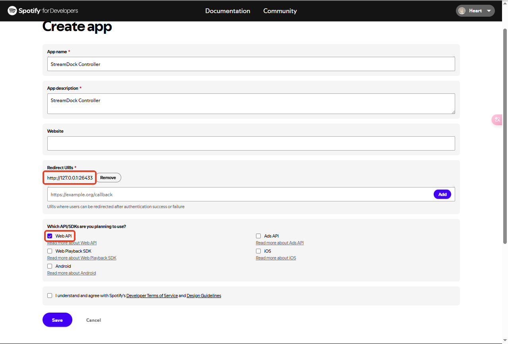

# Spotify Plugin for StreamDock

This is a StreamDock plugin for controlling Spotify.

## Requirements

This is a plugin that uses the software's built-in node module, so it has certain requirements for the version of the StreamDock software.

> [!TIP]
> **Windows**
> - Requires software version `3.10.188.226` or higher
> - Node.js module built-in from version `3.10.188.226` (version 20.8.1)
>
> **Mac**
> - Version `3.10.189.0313` is not built-in yet
> - Please wait for subsequent version updates

## Configuration Instructions

### 1. Get Spotify API credentials

1. Visit [Spotify Developer Dashboard](https://developer.spotify.com/dashboard)

2. Log in to your Spotify account

3. Click "Create app" to create a new app

4. Fill in the app information:

   - App name: Fill in as you like (e.g.: StreamDock Controller)

   - App description: Fill in as you like

   - Website: Can be left blank

   - Redirect URI: `http://127.0.0.1:26433`

   - Which API/SDKs are you planning to use? Select `Web API`

5. Agree to the terms of service and click "Save"

6. On the app details page:

   - Click the "Settings" button

   - Get `Client ID`

   - Click "View client secret" to get `Client Secret`

7. On the Settings page:

   - Make sure Redirect URI is set to `http://127.0.0.1:26433`

### 2. Configure the plugin

1. Add any action of the Spotify plugin in StreamDock

2. Click the action to enter the settings interface

3. Fill in the `Client ID` and `Client Secret` you obtained earlier

4. Click the "Authorize" button

5. Complete the authorization on the pop-up Spotify login page

### 3. Notes

   - A `Spotify Premium` account is required to use the playback control function

   - If you encounter authorization problems, please check whether the `Redirect URI` is set correctly

   - You need to complete the authorization process when using it for the first time

   - If you need to re-authorize, you can click the "Logout" button on the settings interface

## Function list

   - Play/pause control

   - Previous/next song switch

   - Volume control (including mute)

   - Playback device switch

   - Add/remove favorite songs

   - Playlist control

   - Loop/shuffle mode switch

   - Song information display

   - URI Direct Play

## Support

If you encounter problems, please check:

1. Whether `Client ID` and `Client Secret` are configured correctly

2. Whether the correct redirect address is used

3. Whether you have a `Spotify Premium` account

## License

GPL License